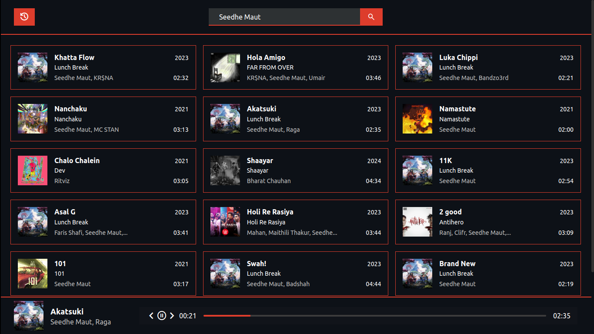

<h1 align="center" ><a href="https://greeed-music.netlify.app/">Music Meister</a></h1>

  

    Fine & Fast Saavn API frontend.  
umm what? A damn good music player!
     
     
  

## About The Project

Started as hackathon project, though I did not succeed, I learnt alot.
Btw, it now works for my submissions in r/unixporn.

### What I learnt building the project: 
* Typescript; The foundations.
* The need for a component library. My latest vanilla JS project :smile:.

### Features
* searchSongs - fetches songs from API
* renderResults - renders search results
* playTrack - plays a track
* onHashChange - router handler
* updateSeekbar - seekbar logic

## Built With

TypeScript, No Runtime Dependency

## Contributing

Contributions are what make the open source community such an amazing place to be learn, inspire, and create. Any contributions you make are **greatly appreciated**.
* If you have suggestions for adding or removing projects, feel free to [open an issue](https://github.com/darshanCommits/musicMeister/issues/new) to discuss it, or directly create a pull request after you edit the *README.md* file with necessary changes.
* Please make sure you check your spelling and grammar.
* Create individual PR for each suggestion.
* Please also read through the [Code Of Conduct](https://github.com/darshanCommits/musicMeister/blob/main/CODE_OF_CONDUCT.md) before posting your first idea as well.

### Creating A Pull Request

1. Fork the Project
2. Create your Feature Branch (`git checkout -b feature/AmazingFeature`)
3. Commit your Changes (`git commit -m 'Add some AmazingFeature'`)
4. Push to the Branch (`git push origin feature/AmazingFeature`)
5. Open a Pull Request

## License

Distributed under the MIT License. See [LICENSE](https://github.com/darshanCommits/musicMeister/blob/main/LICENSE.md) for more information.

## Authors

* **[Darshan Kumawat](https://github.com/darshanCommits)**
* **[Tejas Jondhale](https://github.com/TEJASJONDHALE)** 
